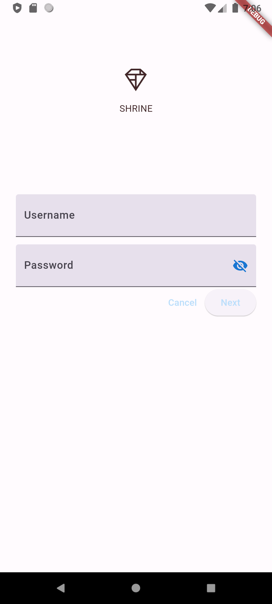
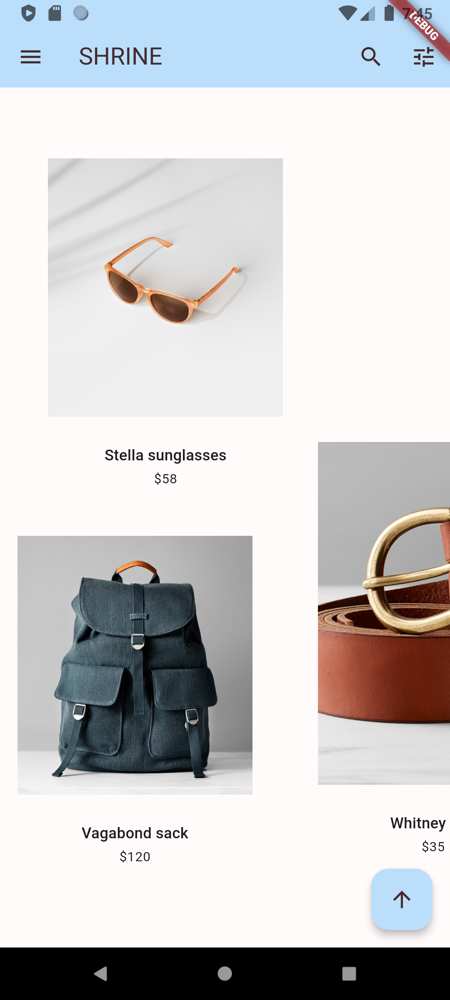
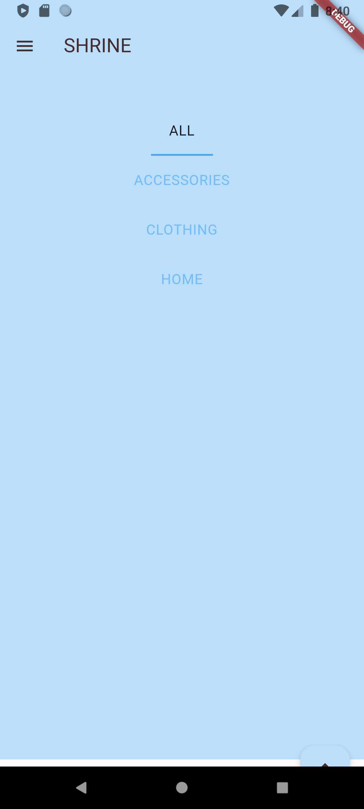

# Material Components (Flutter Codelabs) - Modified by Athalie Aurora

This documentation contains four codelabs for [Material Components for Flutter](https://github.com/material-components/material-components-flutter).

## Introduction

Codelabs MDC-101 through MDC-104 will guide you through building and integrating one application with MDC-Flutter.

### Modified by

This version of the repository has been modified by Athalie Aurora, as part of an assignment for NIM 221511003, Class D3-2A.

## Branches

The starter and completed code is in the various branches of this repo.

## Getting Started

Visit the [Google codelabs site](https://codelabs.developers.google.com/),or
  
1 [codelabs.developers.google.com/codelabs/mdc-101-flutter](https://codelabs.developers.google.com/codelabs/mdc-101-flutter),

2 [codelabs.developers.google.com/codelabs/mdc-102-flutter](https://codelabs.developers.google.com/codelabs/mdc-102-flutter),

3 [codelabs.developers.google.com/codelabs/mdc-103-flutter](https://codelabs.developers.google.com/codelabs/mdc-103-flutter),

4 [codelabs.developers.google.com/codelabs/mdc-104-flutte](https://codelabs.developers.google.com/codelabs/mdc-104-flutter)

to follow along the guided steps.

## Result Modified

Login

Homepage

Category
